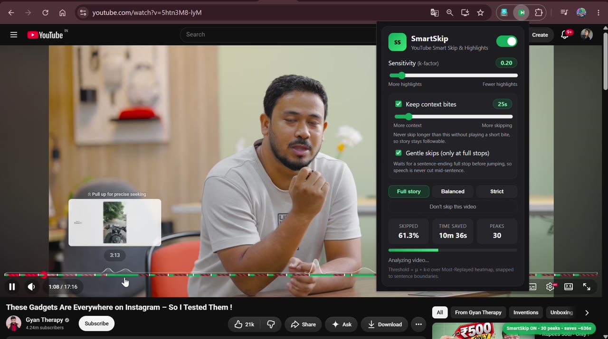
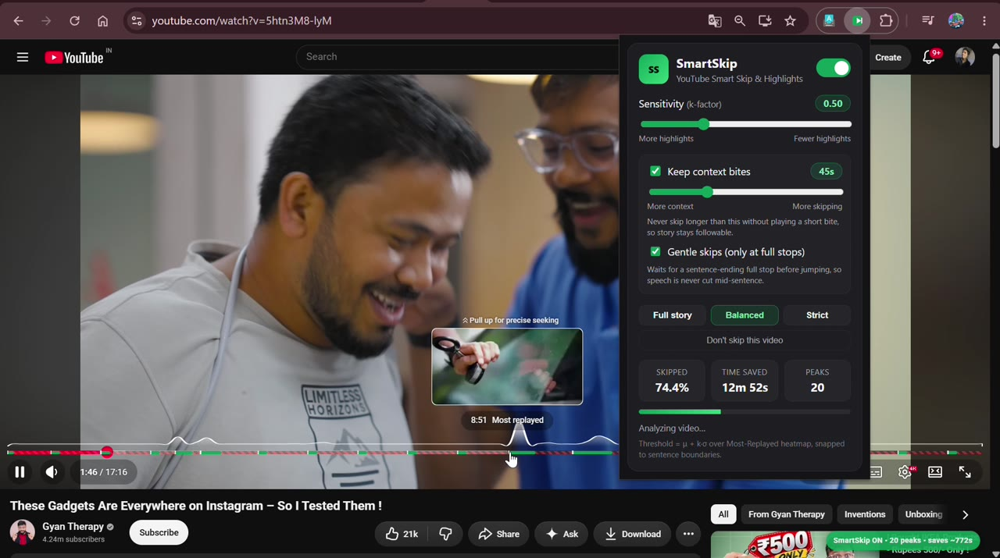
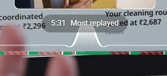

# PeakPlay — YouTube Smart Skip & Highlights

Auto-shortens YouTube videos by skipping low-engagement segments, using the
Most-Replayed heatmap + transcript sentence snapping. Green = keep, red = skip,
directly on the player timeline. 100% local — no server needed.

Created by **Pratham Prajapati**.

## Demo







*Full demo videos (`Demo-Video.mp4`, `Demo-Video-2.mp4`) are gitignored and stay local —
the frames above are the committable highlights.*

## Load the extension
1. Chrome → `chrome://extensions` → Developer mode → Load unpacked
2. Select `smart-skip-extension/`
3. Open any `youtube.com/watch?v=...` with a Most-Replayed graph

## Use
- Popup toggle: enable/disable
- Sensitivity `k` (`μ + k·σ`, 0.1–1.5): lower = more highlights
- Presets: Full story (`k=0.2`, context 25s) / Balanced (`k=0.5`, 45s) / Strict (`k=0.9`, no context)
- Keep context bites: never skip longer than `maxSkip` without an ~8s bite
- **Gentle skips (only at full stops)** (default ON): waits for a sentence-ending
  full stop before jumping instead of cutting mid-sentence. Turn off for instant (choppier) skips.
- Timeline overlay: green keep, red-hatched skip, white tick = jump target (hover for times)
- Skip toast: brief `Skipped 1:13 → 4:02` chip inside the player on every jump
- Per-video opt-out: `Don't skip this video` button pauses skipping for that video only
- `Alt+S`: global toggle (works without opening the popup)
- Auto-tune: first run per video nudges `k` so kept coverage lands in 25–90%
- Manual scrub is respected: auto-skip pauses 5s after your own seek
- All popup changes apply live — no page refresh needed (reload the extension
  only after code changes)

## Structure
```
smart-skip-extension/
├── manifest.json          # MV3: permissions, content scripts, Alt+S command
├── popup/                 # popup.html / popup.css / popup.js
├── content/               # signal_processor.js, transcript_snapper.js,
│                          # content.js (controller), inject.js (page world)
├── background/            # service_worker.js (defaults, Alt+S toggle)
└── icons/                 # extension icons
```

## How it works
- `content/inject.js` (page world) reads live `movie_player.getPlayerResponse()`
  + `ytInitialPlayerResponse`, extracts heat markers and ordered caption tracks
- Transcript sourcing: caption tracks ranked manual-English > auto-English >
  manual-other > auto-other, each tried as-is first (keeps URL signature intact)
  then `json3` / `vtt` / `srv3` — first non-empty parse wins, with word-level
  `tOffsetMs` timestamps preserved for exact landings when YouTube sends them
- `content/signal_processor.js`: EMA smooth → `μ+kσ` threshold → merge (<3s)
  → `addContextKeeps()` (hook + periodic bites in long gaps)
- `content/transcript_snapper.js`: splits caption chunks into sentences
  (time-interpolated), snaps peak edges only to full stops (pause fallback for
  unpunctuated auto-captions), 0.8s pre-roll / 1.1s post-roll; wider buffers when no captions
- `content/content.js`: SPA-aware (`yt-navigate-finish` + URL poll), word-level
  caption timing, sentence-aware deferred jumps (finishes the sentence up to the
  next full stop, then skips), landing guard (playback always resumes at a
  sentence start, never mid-word), volume-fade on jump, gentle full-stop-only mode, ad-aware, throttled
  observers, timeline overlay
- No heatmap → plays normally. No captions → heatmap-only mode with wide buffers.

## Debug (YouTube watch page console)
```
window.__PeakPlay.state            // heatmapFound, peakRanges, transcriptFound
window.__PeakPlay.testSkipNext()   // force a jump
window.__PeakPlay.renderTimeline() // redraw overlay
```
Logs: `[PeakPlay] page-context heatmap | fallback heatmap | transcript ready | peaks ready`.
